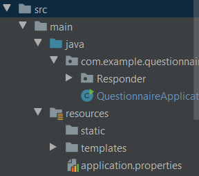

## Usage

### 1. Copy this repository to the folder on your computer

### 2. Make sure you have postgresql management program running on port 5432. If your port is taken and you
### can't change it, go to application.properties in src\main\resources

### and change port number in spring.datasource.url on port which your database is running.
### Then change the spring.datasource.username and spring.datasource.password on your private setup.

### 3. Run the app starting main program in src\main\java\com\example\questionnaire name QuestionnaireApplication.java

### 4. In your browser type localhost:[port number]. You can find port number which on application is running
### in one of the log.

## Directory description

### In src you can find two folders: main and test.
### In main: java where is main class QuestionnaireApplication and folder Responder where are the classes of
### Responder, Diseases theier Repository classes and Service and Controler class.
### And resources wher is templates folder with html code and their resources like pictures
### In test: you can find class with tests which is currently empty.
